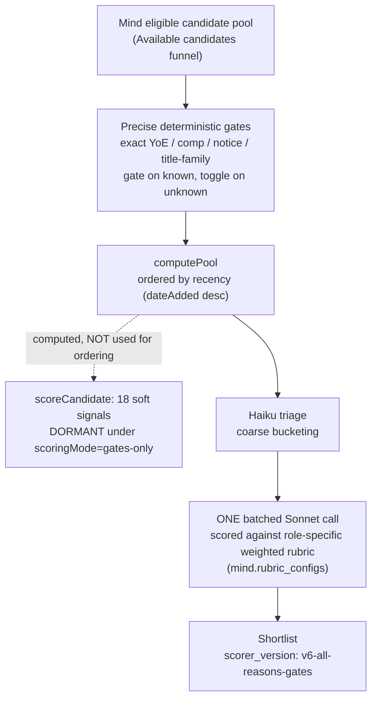
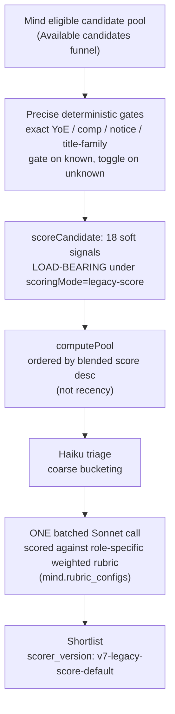
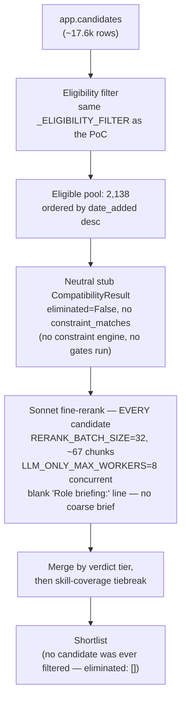

# rec-engine `poc/live-matchmaking` vs. Mind's `main`

This is a reference doc for anyone picking up this branch cold: what Mind's
production matching does today, what this branch does instead, and why. It's
a narrative comparison, not a git diff — Mind and rec-engine are separate
codebases with no shared history.

There are now **four** ways to produce a shortlist for the same role, and
the comparison UI (`ui/src/components/AnalysisPanel.tsx`) can show any of
them side by side.

## Why this branch exists

Mind's candidate matchmaking regressed. The working hypothesis (see
`openspec/changes/live-matchmaking-poc/proposal.md`) is that a "gates-only
redesign" is the cause: 18 soft-matching signals that used to drive ranking
went dormant, candidates get filtered by brittle exact-match hard cutoffs,
and the order handed to the LLM reranker is driven by recency rather than
fit. This branch prototypes a fix — automated, semantic filtering feeding a
similarly-shaped LLM ranking funnel — against live production data, so it
can be judged side by side against what Mind produces today.

## Overview

| | **Mind Live** | **Mind Fixed** | **rec-engine PoC** | **rec-engine LLM-only** |
|---|---|---|---|---|
| **Where it lives** | Read-only via `mind.shortlist_runs` / `mind.shortlist_run_candidates` (production `main`/`staging`) | `mind-fix-legacy-score` worktree, branch `fix/legacy-score-default` — **unmerged, not deployed** | `run_live_pipeline` (`src/funnel_rerank.py`) | `run_llm_only_pipeline` (`src/funnel_rerank.py`), own store/routes (`llm_only_run_store.py`, `/api/llm-only/*`) |
| **How it works** | Deterministic precise gates (exact YoE/comp/notice/title-family) build the pool → recency-ordered into Haiku triage → one batched Sonnet call scored against a role-specific weighted rubric (`mind.rubric_configs`); the 18 soft signals are computed but **dormant** under `scoringMode: 'gates-only'` | Identical to Mind Live except one flag: `scoringMode: 'legacy-score'`, which makes the 18 soft signals load-bearing again instead of dormant. Everything else — gates, triage, batched Sonnet call, rubric weighting — unchanged | Automated constraint extraction + 3-phase constraint engine → deterministic skill-floor gate → lenient title/discipline gate → location/visa check → coarse LLM role brief → best-effort `mind.rubric_configs` lookup → recency-ordered Haiku triage (chunks, 6-way concurrent) → best-bucket selection, truncated in pool order → chunked Sonnet fine-rerank (batches of 32, rubric-aware prompt when found, verdict-tier merge) | Same eligible pool as the PoC, but skips every filtering/triage/truncation stage (including the rubric lookup) — every eligible candidate goes straight into the same chunked Sonnet fine-rerank, run with 8-way concurrency instead of serial |
| **Candidate pool** | Mind's own "Available candidates" funnel, already narrowed further by `computePool` before it's ever recorded — recorded pool sizes (e.g. 54, 64 for role 1360) are late-stage, not the true universe | Same as Mind Live (same gates, same `computePool`) — but empirically drifts run to run (58% overlap with Mind Live for the same role, days apart) | Deterministic reproduction of Mind's "Available candidates" funnel (`live_data._ELIGIBILITY_FILTER`): `is_uk` + `has_cv` + `linkedin_url` + `has_prescreen_notes` + `mind_eligible_since ≥ 2026-01-01`, minus active Bullhorn submissions. 2,138 candidates vs. Mind's reported 2,107 (1.5% off, ~81% recall on a cross-checked sample) | Identical pool to the PoC (2,138) — deliberately equalized so pool-construction effects can't explain any output difference |
| **LLM ranking** | Haiku triage → **one single batched Sonnet call per run**, scored against per-role weighted rubric percentages | Same as Mind Live | Haiku triage (`TRIAGE_TOP_N = 100` cutover) → Sonnet fine-rerank, **chunked** (`RERANK_BATCH_SIZE = 32`, serial by default), prompt carries the role's `mind.rubric_configs` signals when one is found (falls back to generic required/preferred-skills criteria otherwise) — verdict scheme stays rec-engine's own `strong_match`/`good_match`/`possible`/`weak_match`, not Mind's per-signal deterministic score | Same chunked Sonnet fine-rerank as the PoC, same generic criteria (rubric lookup deliberately skipped, see below), but every candidate reaches it (no triage bucket, no truncation) |
| **Rationale** | N/A — this is what's actually in production today; the baseline everything else is measured against | Tests whether restoring the pre-redesign scorer (proposed but never built) fixes the regression, without touching anything else | Prototypes a non-manual-gate alternative to Mind's filtering, while deliberately porting Mind's own validated LLM-ranking shape (batch size, triage cutover, Sonnet-not-Haiku for fine scoring) rather than reinventing it | Isolates one variable: does rec-engine's *own* prefiltering explain its divergence from Mind, or does the gap persist even with an unfiltered pool reaching the same ranker? |

## Mind Live

Read-only, via Supabase (`Accept-Profile: mind`) against `mind.shortlist_runs`
/ `mind.shortlist_run_candidates`. Current default: `scoringMode:
'gates-only'`, `SCORER_VERSION: 'v6-all-reasons-gates'`.

**Pipeline, in order:**
1. **Precise deterministic gates** — exact YoE/comp/notice/title-family
   ranges. Philosophy is "gate on known, toggle on unknown": a candidate
   with no value for a gated field passes rather than being excluded.
2. **Pool ordering** — candidates enter the LLM stage ordered by
   **recency** (`dateAdded` desc), not by any fit signal.
3. **Soft-signal scoring, computed but dormant** — `scoreCandidate`
   still computes all 18 soft-matching signals (skill match, experience
   curve, stage-fit, etc.) but under `gates-only` they don't affect
   ordering at all; the gate pass/fail + recency position is all that
   determines who reaches the LLM stage and in what order.
4. **Haiku triage** — cheap coarse bucketing before the expensive call.
5. **One single batched Sonnet call per run** — not chunked, not
   per-candidate like rec-engine. Scored against a **role-specific
   weighted rubric** pulled from `mind.rubric_configs`.



**Example rubric**, role 1360 ("Ankar Signals V1"): Product Engineer
Ownership 32%, Zero-to-One Building Track Record 29%, Full-Stack Technical
Credibility (skill match) only 10%, Academic Pedigree 9%, AI/LLM Interest
8%, Startup Pace 5%, Communication 4%, Domain Curiosity 3%. This weighting
is invisible to rec-engine's prompt entirely — see rec-engine LLM-only
below for what that costs in practice.

**Caveat on "candidates considered" numbers:** `mind.shortlist_run_candidates`
only ever records candidates already selected into Mind's own `computePool`
step — it does not expose how large Mind's true candidate universe was
before that pool was constructed. Figures pulled from this table (e.g. 54,
64 for role 1360) are a late-stage, already-narrowed count, not comparable
to rec-engine's "eligible pool" number. The Analysis page labels this
"Considered (Mind's pool)" specifically to avoid implying equivalence.

**Pool inconsistency found:** Mind's own pool is small and drifts run to
run — role 1360 Live (64 candidates) and Fixed (52 candidates) only
overlapped 58% with each other despite being the same role days apart,
suggesting `poolLimit` + date-sort slicing isn't stable.

## Mind Fixed

Same Mind codebase and read path as Mind Live; distinguished only by which
run gets selected, keyed by `scorer_version`. This is the
`restore-legacy-score-default` proposal, actually implemented this session
(previously proposed but never built) on a separate worktree
(`mind-fix-legacy-score`, branch `fix/legacy-score-default` off `staging`).
**Not merged or deployed** — a local fix branch, triggered manually against
a dev server for comparison purposes only.

**The actual change, three files:**

```diff
--- a/apps/web/src/lib/types/data-explorer.ts        (DEFAULT_CONFIG)
-  scoringMode: 'gates-only',
+  scoringMode: 'legacy-score',

--- a/apps/web/src/lib/data-explorer/config-validate.ts  (coerceToConfig fallback)
-  scoringMode: enumOr<ScoringMode>(o.scoringMode, [...], d.scoringMode ?? 'gates-only'),
+  scoringMode: enumOr<ScoringMode>(o.scoringMode, [...], d.scoringMode ?? 'legacy-score'),

--- a/apps/web/src/lib/matching/scoring-engine.ts
-export const SCORER_VERSION = USE_CANDIDATE_PROFILE ? 'v6-candidate-profile' : 'v6-all-reasons-gates';
+export const SCORER_VERSION = USE_CANDIDATE_PROFILE ? 'v7-candidate-profile-legacy-score' : 'v7-legacy-score-default';
```

Under `legacy-score`, the 18 soft signals become load-bearing again
(pre-redesign behavior) instead of sitting dormant — and per
`compute-core.ts:46`, this also flips pool ordering itself from
recency-desc to blended-score-desc (`mergeForced`, `compute-core.ts:435`
branches on `scoringMode`). Everything else — precise gates, triage, the
single batched Sonnet call, rubric weighting — is identical to Mind Live.
This isolates one variable on purpose: does restoring the old scorer fix
the regression on its own, without also changing filtering or the LLM
stage.



**Gotcha found while triggering this:** 6 of the 7 live roles have
`scoringMode: 'gates-only'` **explicitly saved** in their
`mind.data_explorer_configs` row, not relying on the code default at all —
so flipping the default alone does nothing for those roles. Every trigger
payload had to explicitly override `configSnapshot.scoringMode =
'legacy-score'` to actually exercise the fix. Confirmed working by
triggering fresh reranks against the fixed-branch dev server (port 3010,
`CRON_SECRET` bearer auth to bypass Clerk) for all 7 roles — resulting rows
correctly stamped `scorer_version: v7-legacy-score-default`.

## rec-engine PoC

`run_live_pipeline` (`src/funnel_rerank.py`) — this branch's full funnel.

**Pipeline, in order:**

1. **Eligibility filter** (`live_data._ELIGIBILITY_FILTER`) — deterministic
   reproduction of Mind's own "Available candidates" funnel: `is_uk` +
   `has_cv` + `linkedin_url IS NOT NULL` + `has_prescreen_notes` +
   `mind_eligible_since ≥ 2026-01-01`, minus anyone with an active
   (non-terminal) `bullhorn_job_submissions` row. Best reproduction found:
   2,138 candidates vs. Mind's reported 2,107 (1.5% off, ~81% recall on a
   cross-checked sample) — not exact, since `is_uk`/`mind_eligible_since`
   show staleness against whatever live computation actually backs Mind's
   own dashboard. Originally this pool was the full unfiltered
   `app.candidates` table (~17.6k rows); narrowing it to Mind's funnel
   means downstream comparisons aren't a filtered pipeline vs. an
   unfiltered one.
2. **Pool ordering** — `date_added` desc (recency), matched to Mind's own
   ordering. Matters because the bucket-truncation step later (step 7) is
   order-sensitive — matching Mind's ordering means truncation degrades
   the same way Mind's does, keeping the comparison meaningful.
3. **Constraint extraction + 3-phase constraint engine**
   (`extraction.py` + the engine): canonical-key match → semantic/embedding
   fallback → "no candidate-side data = compatible" default. Structurally
   *cannot* gate on skills — candidate-side constraints are only typed
   fields (salary/notice/visa/working-model).
4. **Deterministic skill-floor gate** (`_apply_skill_floor_check`,
   `SKILL_FLOOR_RATIO = 0.4`) — eliminates anyone evidencing under 40% of
   required skills. This is the single biggest cut in the funnel: for role
   1650 (12 required skills), 1,326 of 2,138 eligible candidates were
   eliminated here, the large majority for evidencing 0-4/12 skills.
4.5. **Deterministic compensation-band gate** (`_apply_compensation_band_check`,
    `COMPENSATION_ELIMINATION_RATIO = 0.20`) — eliminates candidates whose
    salary figure on file is >20% above the role's stated salary ceiling
    (found via `_employer_salary_ceiling`, not canonical-key matching — see
    "Fixes made along the way" below). Lenient by design: a smaller gap
    survives with a "Compensation signal" fine-rerank prompt line instead.
4.6. **Deterministic experience-overqualification gate**
    (`_apply_experience_overqualification_check`,
    `EXPERIENCE_ELIMINATION_YEARS = 6`) — on roles whose stated minimum
    years of experience is itself low (`EXPERIENCE_GATE_MAX_TARGET_YEARS = 3`
    — keyed off the stated *number*, not the `job.seniority` label; see
    "Fixes made along the way" below for why), eliminates candidates >6 yrs
    past that minimum. Never fires for being under the minimum.
5. **Title/discipline gate** (`_apply_title_relevance_check`) — lenient,
   title-text-only embedding similarity, low elimination floor; catches
   only genuinely wrong-discipline candidates, never an adjacent one.
6. **Location/visa check.**
7. **Coarse role brief** (`coarse_role_brief`) — an LLM framing call
   producing a one-line summary, injected into the fine-rerank prompt as
   "Role briefing: ...".
8. **Haiku triage** (only if survivors > `TRIAGE_TOP_N = 100`) — chunks of
   40, 6 concurrent, buckets each candidate into `strong`/`maybe`/`no`
   using a thin summary (name/years/seniority/skills, not full CV text).
9. **`select_by_coarse_bucket`** (`src/funnel_rerank.py:654`) — takes the
   single best non-empty bucket (strict priority: `strong` > `maybe` >
   `no`), truncated to `top_n = 200` **in incoming pool order** — i.e. by
   recency, not re-sorted by fit. If more than 200 land in `strong`, the
   ones cut are the least-recently-added `strong` candidates, not the
   worst-fitting ones. This mirrors how Mind's own gates-only truncation
   degrades, so it's a deliberate parity choice, not an oversight — but
   worth knowing when a specific candidate is missing from a large role's
   rerank pool.
9.5. **Mind rubric lookup** (`mind_rubric_store.get_rubric_for_role`) — a
    best-effort read of `mind.rubric_configs` for this role (role-specific
    row, falling back to a global `role_id IS NULL` template, else none).
    Formatted (`_format_rubric_signals`) and threaded into the fine-rerank
    prompt below the same way `coarse_role_brief` is — role-level context
    computed once, reused by every chunk.
10. **Sonnet fine-rerank** (`fine_rerank`, `FINE_RERANK_MODEL =
    claude-sonnet-5`) — chunks of `RERANK_BATCH_SIZE = 32`, serial by
    default, each a forced tool-use call producing
    `strong_match`/`good_match`/`possible`/`weak_match` verdicts +
    rationale per candidate, judged against fixed role criteria — now
    including the role's weighted rubric signals when one was found, not
    just generic required/preferred skills (not batch-relative either way).
    Merged by verdict tier, then skill-coverage count as tiebreak.

```mermaid
flowchart TD
    A["app.candidates<br/>(~17.6k rows)"] --> B["Eligibility filter<br/>is_uk + has_cv + linkedin_url +<br/>has_prescreen_notes + mind_eligible_since ≥ YTD<br/>minus active Bullhorn submissions"]
    B --> C["Eligible pool: 2,138<br/>ordered by date_added desc (recency)"]
    C --> D["3-phase constraint engine<br/>canonical-key → semantic fallback → compatible-by-default<br/>(salary / notice / visa / working-model only — no skills)"]
    D --> E["Deterministic skill-floor gate<br/>SKILL_FLOOR_RATIO = 0.4<br/>biggest single cut in the funnel"]
    E --> E2["Deterministic compensation-band gate<br/>COMPENSATION_ELIMINATION_RATIO = 0.20"]
    E2 --> E3["Deterministic experience-overqualification gate<br/>stated min ≤ 3 yrs, EXPERIENCE_ELIMINATION_YEARS = 6"]
    E3 --> F["Title/discipline gate<br/>lenient, title-text embedding similarity"]
    F --> G["Location/visa check"]
    G --> H["Coarse role brief<br/>LLM one-line framing call"]
    H --> H2["mind.rubric_configs lookup<br/>role-specific → global template → none<br/>best-effort, degrades to generic prompt"]
    H2 --> I{"More than 100 candidates<br/>passed the filters?"}
    I -- yes --> J["Haiku triage<br/>chunks of 40, 6-way concurrent<br/>buckets: strong / maybe / no"]
    J --> K["select_by_coarse_bucket<br/>best non-empty bucket, top_n=200<br/>truncated in POOL ORDER (recency), not by fit"]
    I -- no --> K
    K --> L["Sonnet fine-rerank<br/>RERANK_BATCH_SIZE=32, serial chunks<br/>role rubric signals + verdict: strong/good/possible/weak_match"]
    L --> M["Merge by verdict tier,<br/>then skill-coverage tiebreak"]
    M --> N["Shortlist"]
```



**Why the filtering stages are automated rather than manual gates.** Manual
gates are exactly what's suspected of causing Mind's regression (brittle
exact-match, easy to silently misconfigure). Automated extraction from JD +
briefing text means no manual gate configuration is needed at all, and the
constraint engine's semantic fallback catches phrasing variance a manual
gate would miss (confirmed live: nuanced deal-breakers like commute limits
and ethical/company-type exclusions matched correctly that an exact-match
gate would likely miss).

**Why a dedicated skill-floor gate exists separately from the constraint
engine.** Investigated and confirmed (see
`openspec/changes/live-matchmaking-poc/investigation-hard-constraint-gap.md`)
that the constraint engine structurally cannot gate on skill fit —
candidate-side constraints never include skills, so the engine's own "no
candidate constraint found → compatible" default let every candidate
through regardless of stack match. This isn't a new mechanism so much as
restoring something already load-bearing pre-redesign: on Mind `main`,
`skill_coverage()`/`required_skills_overlap` was the single
heaviest-weighted signal (38%) in the weighted-linear scorer this PoC's
funnel replaces.

**Why the title gate is separate and deliberately lenient.** Nothing else
in the live pipeline checks title/discipline relevance at all —
`retrieval.py`'s general JD-vs-bio embedding similarity was deliberately
kept out of the pre-filter path (it conflates skills/constraints wording
with title, and was found in testing to drop genuinely qualified
candidates before their real constraints were even checked). This gate is
narrower on purpose: title text only, low floor.

**Why Mind's Haiku-triage-then-Sonnet-fine-rerank shape was ported, not
reinvented.** Confirmed by reading Mind's actual production rerank
(`mind/apps/web/src/lib/reranks/`) that a single LLM call over a large pool
isn't how Mind handles scale either — a fixed max_tokens-scaling formula
(this branch's original approach) hits Anthropic's output ceiling well
before covering a large pool regardless of model. Mind's fix (fixed batch
size + serial calls by default, not concurrent — a prior production
incident found concurrent long-lived Sonnet streams starved Mind's Node.js
event loop) is the validated pattern, so it's ported directly. Also
ported: fine-rerank verdicts run on Sonnet, not Haiku — Mind's own
reasoning ("Haiku's confidence isn't calibrated enough for a fine score")
applies directly.

**Why Mind's absolute/boost-only scoring rubric was not ported.** Mind's
merge across chunks only works because its score is an absolute 0-10
designed to be comparable with zero shared context between chunks. This
branch's fine-rerank already produces a categorical verdict judged against
fixed role criteria, not a batch-relative ranking — so merging by verdict
tier, then by already-computed skill-coverage count as a tiebreaker, is
valid without redesigning the scoring rubric or tool schema.

**Mind's per-role rubric weighting IS now ported — the fix this branch's own
analysis called for.** Mind's Sonnet call is scored against a weighted
rubric pulled from `mind.rubric_configs` (see the Mind Live rubric example
above — skill match is only 10% of one role's score). rec-engine's
fine-rerank prompt used to carry only generic required/preferred skills,
with no visibility into what a role's shortlist should actually be
optimizing for — confirmed a real, not cosmetic, source of divergence (see
rec-engine LLM-only below). `mind_rubric_store.get_rubric_for_role`
(`src/mind_rubric_store.py`) reads the same `mind.rubric_configs` table via
the same read-only PostgREST/`Accept-Profile: mind` path `mind_run_store.py`
already uses, resolves the role-specific row (falling back to a reusable
`role_id IS NULL` global template, then to nothing) if it has the current
`signals` shape populated, and `funnel_rerank.fine_rerank` injects it into
every chunk's prompt exactly the way `coarse_role_brief` already gets
injected — same "role-level context computed once, threaded through every
chunk" shape, same graceful degradation to today's generic prompt if no
rubric is configured for a role or Mind's schema isn't reachable.

**What was deliberately NOT ported along with it.** Mind's reranker has the
LLM emit a `strong`/`partial`/`absent`/`violated` verdict *per signal* and
computes the weighted 0-10 score deterministically afterward
(`signal-scoring.ts`) — a second scoring pipeline and a different tool
schema. Porting that would mean redesigning `FINE_RERANK_TOOL_SCHEMA` and
`_merge_ranked_batches`' verdict-tier merge, which is exactly the kind of
rescoring-pipeline change the "absolute/boost-only scoring rubric" section
above already explains isn't needed here. Instead, `_format_rubric_signals`
only reshapes the *prompt* — the rubric's signals (id/label/tier/weight/
guidance, plus any gating signals) are listed as the criteria to judge fit
against, with an explicit instruction to weight them over generic skill
overlap, but the LLM still returns rec-engine's own
`strong_match`/`good_match`/`possible`/`weak_match` verdict + rationale, and
`_merge_ranked_batches` is untouched. Small, concrete, and reversible — not
the rearchitecture Mind's own scoring pipeline would require.

## rec-engine LLM-only

`run_llm_only_pipeline` (`src/funnel_rerank.py`) — built to answer a
specific question: does rec-engine's own prefiltering (constraint engine,
skill floor, title gate, triage/truncation) explain why its output
diverges from Mind's, or is the divergence coming from somewhere else
entirely?

**What it keeps from the PoC:** the same eligible pool (2,138, same
`_ELIGIBILITY_FILTER`), job parsing, and the exact same chunked Sonnet
`fine_rerank` call (same model, same batch size, same tool schema, same
verdict-tier merge).

**What it skips, relative to `run_live_pipeline`:**
- No constraint engine (no hard cutoffs)
- No skill-floor / title-relevance / location checks
- No coarse role brief (blank "Role briefing:" line in the prompt — an
  honest gap, not a fabricated one)
- No `mind.rubric_configs` lookup (`rubric_used` is always `null` in the
  response) — deliberately, to keep this pipeline's one isolated variable
  (rec-engine's own prefiltering) from being conflated with the separate
  rubric-visibility question
- No Haiku triage, no bucket truncation

Every one of the 2,138 candidates goes straight into `fine_rerank`, with a
neutral stub `CompatibilityResult(eliminated=False, constraint_matches=[])`
per candidate so the prompt template still renders (shows "(no employer
constraints extracted)" instead of real gate annotations). At
`RERANK_BATCH_SIZE = 32` that's ~67 batches; run with
`LLM_ONLY_MAX_WORKERS = 8` (`ThreadPoolExecutor`) rather than the serial
default everywhere else — serial would take well over an hour per role.
The rest of the codebase stays serial by default (`max_workers = 1`),
matching Mind's own finding that concurrent long-lived Sonnet streams
starved its event loop — a Node.js-specific constraint that doesn't
transfer to this Python/FastAPI service, kept as the default elsewhere
anyway so nothing else changes behavior.



Persisted separately from the regular pipeline (`llm_only_run_store.py`,
own directory `data/llm_only_runs/`, own routes
`/api/llm-only/{recommend,runs,runs/{run_id}}`) — deliberately not mixed
with `live_run_store` runs, since they're genuinely different pipelines for
the same role.

**What this isolated:** with pool construction equalized, coverage of
Mind's actual shortlisted candidates in rec-engine's output jumped from a
handful to 92% (role 1360) — confirming prefiltering was a real source of
"candidate not found at all." But top-20 overlap with Mind's picks was
still effectively zero, and several of Mind's top-10 scored `weak_match`
from rec-engine specifically for missing skills. That pointed at the
actual remaining cause: rec-engine's rerank prompt has no visibility into
a role's weighted rubric (skill match is only 10% of Mind's score for
role 1360, but it's close to the *only* thing rec-engine's generic prompt
judges on). Equalizing the pool closed the coverage gap; it did not close
the ranking-quality gap, because that gap is structural (rubric
blindness), not a filtering artifact.

## Fixes made along the way

These apply to both rec-engine pipelines, since PoC and LLM-only share the
same `fine_rerank` implementation.

**Fine-rerank had no explicit seniority/experience target or salary-band
signal, and its system prompt actively told the model salary was already
handled.** Found live: a junior/mid role (CoLoop Product Engineer, £70K-£90K,
1+ yrs) surfaced 10+-YoE candidates already earning £110-120k near the top.
Root cause, confirmed against live data: (1) `job.min_years_experience` /
`job.seniority` were extracted but never made it into the fine-rerank
prompt at all — only the coarse role brief's free-text summary might
mention them incidentally; (2) `FINE_RERANK_SYSTEM` explicitly claimed
"salary range... already been checked — do not re-litigate", which is
false — candidate-side salary is always a soft constraint
(`live_data._build_candidate_constraints`), and elimination only fires on
the *employer* constraint's hard/soft type, so a real mismatch can (and, in
this case, did) sail through as "no candidate constraint found ->
compatible" even with the number sitting right there. Fixed by adding two new deterministic gates,
`_apply_compensation_band_check` and `_apply_experience_overqualification_check`
— the same shape as `_apply_skill_floor_check`/`_apply_title_relevance_check`:
`job.min_years_experience`/`job.seniority` (like skills) are never
represented as `Constraint` objects at all, so the generic constraint engine
structurally cannot gate on them either, and salary specifically also hits
the canonical-key-drift failure already fixed for the UK/visa check (the
employer's LLM-assigned key isn't guaranteed to match the candidate's
hardcoded `"salary_min"` key). `_employer_salary_ceiling` sidesteps that by
keying off `currency is not None` instead (extraction.py's own schema
documents `currency` as reliably set only for salary constraints). Lenient
two-tier thresholds, same philosophy as `SKILL_FLOOR_RATIO`/
`TITLE_RELEVANCE_FLOOR`: `COMPENSATION_ELIMINATION_RATIO`/
`EXPERIENCE_ELIMINATION_YEARS` deterministically eliminate only a clear-cut
mismatch (live-validated: both real over-band CoLoop candidates, 33%/22%
over the stated ceiling, correctly excluded); a smaller gap under that
threshold survives to fine-rerank instead, surfaced via two computed,
non-inferred prompt lines (`_candidate_experience_fit_line`,
`_compensation_fit_line`, own lower `SIGNAL` thresholds) mirroring the
already-validated "Role skill fit" line shape — plus correcting
`FINE_RERANK_SYSTEM`'s previously-false "already checked" claim about
salary. The experience gate only applies to junior/mid roles (extra
experience isn't a problem on a senior/lead/principal posting) and never
fires for being UNDER the stated minimum — years-of-experience is too weak
a proxy to eliminate on the low side.

**First version of the compensation-band gate still let a real over-band
candidate through.** `_employer_salary_ceiling`'s first cut only counted
`type == hard` constraints as a ceiling — deliberately, to avoid producing
a hard-sounding "above the band" line off a constraint the JD extraction
call happened to mark soft. In practice this reintroduced the exact problem
the gate exists to route around: whether a stated range like "£70K-£90K"
reads as a strict cap or an advertised range is itself an inconsistent LLM
judgment call, so on a run where extraction landed on `soft` for that
constraint, the gate silently found no ceiling at all and did nothing —
confirmed live on job_order_id 1409, where a real over-band candidate
(Chris Arderne, £120k vs the £90k ceiling) still wasn't excluded despite
the gate being live and the candidate index having the correct, current
salary data (checked directly — not a stale-index problem). Fixed by
dropping the `type == hard` requirement entirely: any currency-bearing
constraint is only ever produced for an actually-stated compensation
figure (extraction.py's few-shot examples never infer one), so hard or
soft, it's valid ceiling evidence.

**Experience-overqualification gate scoped on `job.seniority` let 10-19.5 yr
candidates through a role that explicitly asked for 2+ years.** Same root
cause pattern as the fix above: `_apply_experience_overqualification_check`
originally only ran when `job.seniority in ("junior", "mid")`, on the
assumption that extra experience is only a problem on a role labeled that
way. job_order_id 1596 (Calibre, "2+ years of professional experience...
ready to operate at a senior level. This isn't a typical junior role")
broke that assumption live: that framing plausibly gets `job.seniority`
extracted as `"senior"` — a categorical field the model derives from
tone/scope language — even though `min_years_experience` correctly stays
2, a directly-stated number. Gating on the categorical field silently
disabled the whole check for this role; five real candidates (11, 19.5, 10,
16, 15 yrs) all still reached the top of the shortlist. Fixed by re-scoping
the check on `job.min_years_experience <= EXPERIENCE_GATE_MAX_TARGET_YEARS`
(3) instead of the seniority label — the number the JD actually states, not
a derived category — applied consistently in both the elimination gate and
the "Experience fit" prompt line (`_candidate_experience_fit_line` had the
identical bug). Re-verified against the exact Calibre scenario: all five
candidates now correctly excluded.

**Sonnet 5 rejects any non-default sampling params.** An earlier attempt to
pin `temperature=0.0` on the fine-rerank call for determinism was actually
breaking every call — `claude-sonnet-5` (and the whole Opus 5 / Fable 5 /
4.7 / 4.8 family) returns a 400 on any non-default `temperature`, `top_p`,
or `top_k`. Removed entirely; determinism is handled by the `postprocess`/
`validate` hooks below instead, not sampling params.

**Occasional stringified-JSON output from the fine-rerank tool call.**
Sonnet would sometimes return the `ranked` array as a JSON *string* instead
of a native array (once double-nested), sometimes with a stray trailing
comma. Root-caused as a serialization quirk, not a reasoning problem — the
underlying rankings were always well-formed and sensibly ordered once
parsed. Fixed via `_coerce_stringified_json` (a `postprocess` hook run
before schema validation, with a lenient trailing-comma repair), with
`retries=3` on the fine-rerank chunk call. A chunk that's still stubborn
after 3 attempts degrades gracefully to an empty/flagged result rather than
crashing the whole run — the residual failure rate on some batches is
~6-8% even with retries, so this path does get exercised in practice.

**`RERANK_BATCH_SIZE` corrected from 40 to 32.** The `max_tokens = min(1024
+ 220×N, 8192)` scaling formula's cap meant a batch of 40 could silently
truncate the model's output before it finished the array — a batch of 32
stays safely under the 8192 ceiling for every candidate in the chunk.

## Validated live, not just in theory

Checked against real Mothership data, not just reasoned about:

- **LightWork AI, Platform/Backend Engineer** (the original bug report,
  `job_order_id` 1650): full-universe run completed in ~8.5 minutes
  post-fix, top 15 ranked candidates all showing 9-13 of 15 required skills
  evidenced, sensible verdict tiering, 37 candidates cut by the
  title-relevance gate at 0.12-0.30 similarity (genuinely different
  disciplines).
- **Ankar AI, Product Engineer** (`job_order_id` 1360): same pattern — top
  candidates 5-6 of 6 required skills, no repeat of the "top-ranked survivor
  missing half the required stack" failure mode from the pre-fix baseline.
- The skill-floor threshold (`0.4`) was deliberately **not** raised despite
  looking loose on paper for short skill lists — fresh live runs didn't
  support tightening it once the real bottleneck (only 30 of 1,700+
  filter-passed candidates ever reaching the LLM stage, chosen by embedding
  similarity rather than real judgment) was fixed instead.
- **LLM-only pipeline**, roles 1360/1535/1650: confirmed the coverage vs.
  ranking-quality split described above — prefiltering explains missing
  candidates, rubric blindness explains ranking mismatches even once
  candidates are present.

See `openspec/changes/live-matchmaking-poc/tasks.md` (section 9-10) for the
full tuning history and before/after numbers.
